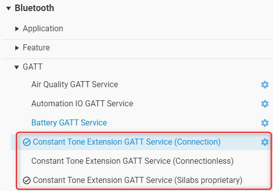

# SoC - AoA Asset Tag

This example application demonstrates a CTE (Constant Tone Extension) transmitter that can be used as an asset tag in a direction finding setup estimating Angle of Arrival (AoA). Test this example with **NCP - AoA Locator**, which (when used together with the **aoa_locator host** applications) can estimate the direction of the asset tag.

> Note: this example does not include Device Firmware Update (DFU) functionality by default. For details see the Device Firmware Update section.

## Getting Started

To learn the basics of Bluetooth direction finding technology , see [UG103.18: Bluetooth Direction Finding Fundamentals](https://www.silabs.com/documents/public/user-guides/ug103-18-bluetooth-direction-finding-fundamentals.pdf).

To get started with Silicon Labs Bluetooth and Simplicity Studio, see [QSG169: Bluetooth SDK v3.x Quick Start Guide](https://www.silabs.com/documents/public/quick-start-guides/qsg169-bluetooth-sdk-v3x-quick-start-guide.pdf).

To get started with Silicon Labs' Direction Finding Solution, see [QSG175: Silicon Labs Direction Finding Solution Quick-Start Guide](https://www.silabs.com/documents/public/quick-start-guides/qsg175-direction-finding-solution-quick-start-guide.pdf)

In an AoA direction finding use case, the tag acts as a transmitter and the locator acts as a receiver. The locator determines the direction of the tag by sampling the signal of the tag on different antennas of an antenna array and measuring phase differences.

To estimate the direction of the incoming signal, the AoA - Locator needs to receive a special Bluetooth packet, which has a Constant Tone Extension (CTE). CTEs can be transmitted:

* Via a Bluetooth connections (connection oriented mode).
* In periodic advertisements (connectionless mode).
* Attached to extended advertisements. This is not part of the Bluetooth standard, but is a Silicon Labs proprietary solution (Silabs mode)

This example:

* Transmits connectable advertisements, and makes it possible to enable CTE on the established connections
* Transmits Silicon Labs proprietary extended advertisements with CTE to let multiple locators receive the same signal

This makes it possible for locators to locate the asset tag.

## Configuring the CTE Transmit Method

By default the asset tag is connectable, and CTEs can be enabled and requested via a connection. Additionally, Silicon Labs proprietary non-connectable extended advertisements with CTE are also sent out periodically, so that (multiple) locators can locate the tag without connecting to it. These features are enabled by the installed **Constant Tone Extension GATT Service (Connection)** and **Constant Tone Extension GATT Service (Silabs proprietary)** software components

To transmit standard periodic advertisements instead of Silicon Labs proprietary extended advertisements, in the Project Configurator uninstall the **Constant Tone Extension GATT Service (Silabs proprietary)** component and install the **Constant Tone Extension GATT Service (Connectionless)** software component.

## Testing the SoC - AoA Asset Tag Application

AoA Asset Tag can be tested together with an AoA Locator. After programming the board with the **SoC - AoA Asset Tag** example, attach an antenna array board, create an **NCP - AoA Locator example**, and then follow the instructions in [AN1296: Application Development with Silicon Labs’ RTL Library](https://www.silabs.com/documents/public/application-notes/an1296-application-development-with-rtl-library.pdf).

## Device Firmware Update

This example project does not include Device Firmware Update (DFU) functionality by default, but it can be added easily.
SoC applications can use one of Silicon Labs' Over-the-Air (OTA) DFU implementations. The table below summarizes the options:

|                           | In-place OTA DFU                 | Application OTA DFU                 |
|---------------------------|----------------------------------|-------------------------------------|
| **Component to add**      | In-place OTA DFU                 | Application OTA DFU                 |
| **Compatible bootloader** | Bluetooth Apploader OTA DFU      | Bootloader - SoC Internal Storage (Series 2)   Bootloader - SoC Storage (Series 3) |
| **Reference solution**    | Bluetooth - SoC In-Place OTA DFU | Bluetooth - SoC Application OTA DFU |
| **Supported devices**     | Supports Series 2 devices only and requires a smaller flash size | Supports Series 2 and Series 3 devices with enough flash to store firmware images in 2 instances |

To add DFU to an existing project:
- Add the appropriate DFU component to your project using Simplicity Studio’s Software Component browser.
- Add a post-build step to generate the GBL (Gecko Bootloader) file using Simplicity Studio’s Post Build Editor.
- Rebuild the project.
- Flash a compatible bootloader to the device.

For more information on bootloaders, see [UG103.6: Bootloader Fundamentals](https://www.silabs.com/documents/public/user-guides/ug103-06-fundamentals-bootloading.pdf) and [UG489: Silicon Labs Gecko Bootloader User's Guide for GSDK 4.0 and Higher](https://www.silabs.com/documents/public/user-guides/ug489-gecko-bootloader-user-guide-gsdk-4.pdf).

## Troubleshooting

### Programming the Radio Board

Before programming the radio board mounted on the mainboard, make sure the power supply switch is in the AEM position (right side) as shown below.

## Resources

[Bluetooth Documentation](https://docs.silabs.com/bluetooth/latest/)

[UG103.14: Bluetooth LE Fundamentals](https://www.silabs.com/documents/public/user-guides/ug103-14-fundamentals-ble.pdf)

[UG103.18: Bluetooth Direction Finding Fundamentals](https://www.silabs.com/documents/public/user-guides/ug103-18-bluetooth-direction-finding-fundamentals.pdf)

[QSG169: Bluetooth SDK v3.x Quick Start Guide](https://www.silabs.com/documents/public/quick-start-guides/qsg169-bluetooth-sdk-v3x-quick-start-guide.pdf)

[QSG175: Silicon Labs Direction Finding Solution Quick-Start Guide](https://www.silabs.com/documents/public/quick-start-guides/qsg175-direction-finding-solution-quick-start-guide.pdf)

[AN1296: Application Development with Silicon Labs’ RTL Library](https://www.silabs.com/documents/public/application-notes/an1296-application-development-with-rtl-library.pdf)

[Bluetooth Training](https://www.silabs.com/support/training/bluetooth)

## Report Bugs & Get Support

You are always encouraged and welcome to report any issues you found to us via [Silicon Labs Community](https://www.silabs.com/community).