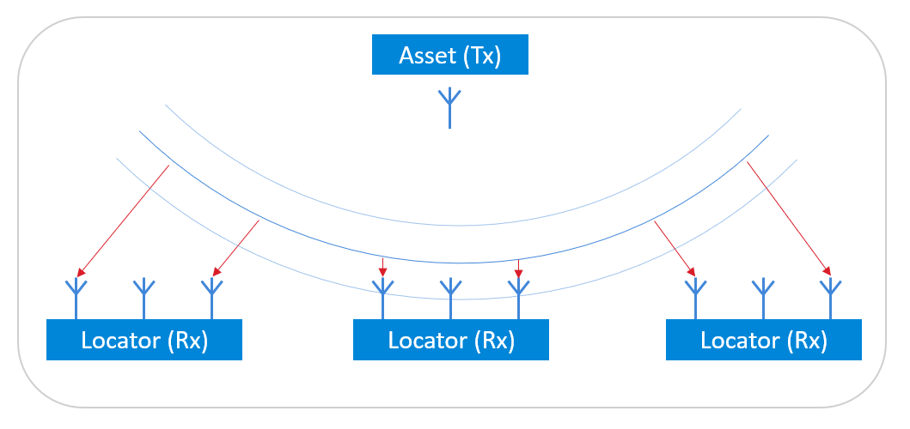
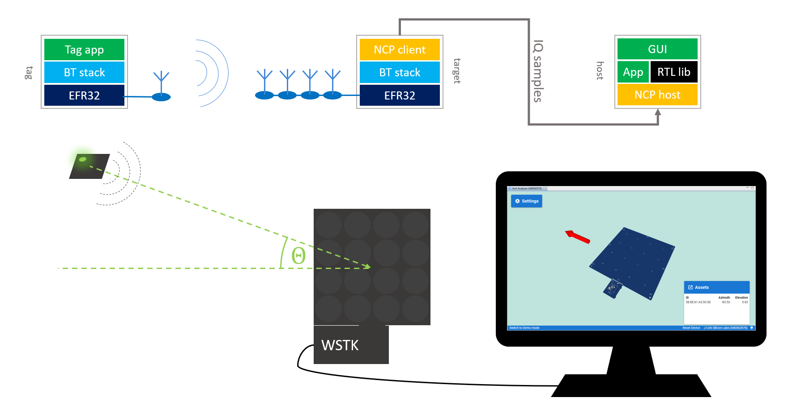

# NCP - AoA Locator

This is an NCP (Network Co-Processor) target example to be used together with the **aoa_locator** NCP host example. The **NCP - AoA Locator** NCP target and the **aoa_locator** NCP host examples together demonstrate a locator that can receive CTEs  (Constant Tone Extensions) from asset tags and estimate their directions (AoA - Angle of Arrival).

Use this example together with **SoC - AoA Asset Tag**, which can transmit CTE signals.

> Note: This example does not include Device Firmware Update (DFU) functionality by default. For details see the [Device Firmware Update](#device-firmware-update) section.

## Getting Started

To get started with Silicon Labs Bluetooth software and Simplicity Studio, see [QSG169: Bluetooth SDK v3.x Quick-Start Guide](https://www.silabs.com/documents/public/quick-start-guides/qsg169-bluetooth-sdk-v3x-quick-start-guide.pdf).

To learn how an NCP (Network Co-Processor) setup works, see [AN1259: Using the v3.x Silicon Labs Bluetooth Stack in Network Co-Processor Mode](https://www.silabs.com/documents/public/application-notes/an1259-bt-ncp-mode-sdk-v3x.pdf). You should also test the **NCP - Empty** example first.

To learn the basics of Bluetooth direction finding technology, see [UG103.18: Bluetooth Direction Finding Fundamentals](https://www.silabs.com/documents/public/user-guides/ug103-18-bluetooth-direction-finding-fundamentals.pdf).

To get started with Silicon Labs' Direction Finding Solution, see [QSG175: Silicon Labs Direction Finding Solution Quick-Start Guide](https://www.silabs.com/documents/public/quick-start-guides/qsg175-direction-finding-solution-quick-start-guide.pdf).

In an AoA direction finding use case, the tag acts as a transmitter and the locator acts as a receiver. The locator determines the direction of the tag by sampling the signal of the tag on different antennas of an antenna array and measuring phase differences.

To estimate the direction of the incoming signal, the AoA Locator needs to receive a special Bluetooth packet, which has a Constant Tone Extension (CTE). CTEs can be transmitted in the following ways:

* Via a Bluetooth connections (connection oriented mode)
* In periodic advertisements (connectionless mode)
* Attached to extended advertisements, which is not part of the Bluetooth standard, but is a Silicon Labs proprietary solution (Silicon Labs mode).

This example provides support for the following:

* Requesting and receiving CTEs on connections
* Receiving CTEs from periodic advertisements and Silicon Labs proprietary extended advertisements
* Taking IQ samples on the received CTEs.

This way, the NCP host example can locate the asset tag by estimating the Angle of Arrival from the received IQ samples.

**NCP - AoA Locator** target can be run on antenna array boards only. **aoa_locator** host is typically run on PC or Raspberry Pi.

The whole setup looks like this:

## Testing the NCP - AoA Locator Application

After programming your antenna array board with the **NCP - AoA Locator** target example, program another board with an **SoC - AoA Asset Tag** example, and then start the **AoA Analyzer** tool as described in [QSG175: Silicon Labs Direction Finding Solution Quick-Start Guide](https://www.silabs.com/documents/public/quick-start-guides/qsg175-direction-finding-solution-quick-start-guide.pdf).

## Device Firmware Update

This example project does not include Device Firmware Update (DFU) functionality by default.
To add DFU to an existing project:
- Add the `Bootloader Interface` component to your project using Simplicity Studio’s Software Component browser.
- Add a post-build step to generate the GBL (Gecko Bootloader) file using Simplicity Studio’s Post Build Editor.
- Rebuild the project.
- Flash the `Bootloader - NCP BGAPI UART DFU` bootloader to the device.

See the `Bluetooth - NCP DFU` example solution for reference.

For more information on bootloaders, see [UG103.6: Bootloader Fundamentals](https://www.silabs.com/documents/public/user-guides/ug103-06-fundamentals-bootloading.pdf) and [UG489: Silicon Labs Gecko Bootloader User's Guide for GSDK 4.0 and Higher](https://cn.silabs.com/documents/public/user-guides/ug489-gecko-bootloader-user-guide-gsdk-4.pdf).

## Troubleshooting

### Programming the Radio Board

Before programming the radio board mounted on the mainboard, make sure the power supply switch is in the AEM position (right side) as shown below.

## Resources

[Bluetooth Documentation](https://docs.silabs.com/bluetooth/latest/)

[UG103.14: Bluetooth LE Fundamentals](https://www.silabs.com/documents/public/user-guides/ug103-14-fundamentals-ble.pdf)

[UG103.18: Bluetooth Direction Finding Fundamentals](https://www.silabs.com/documents/public/user-guides/ug103-18-bluetooth-direction-finding-fundamentals.pdf)

[QSG169: Bluetooth SDK v3.x Quick-Start Guide](https://www.silabs.com/documents/public/quick-start-guides/qsg169-bluetooth-sdk-v3x-quick-start-guide.pdf)

[QSG175: Silicon Labs Direction Finding Solution Quick-Start Guide](https://www.silabs.com/documents/public/quick-start-guides/qsg175-direction-finding-solution-quick-start-guide.pdf)

[AN1296: Application Development with Silicon Labs’ RTL Library](https://www.silabs.com/documents/public/application-notes/an1296-application-development-with-rtl-library.pdf)

[Bluetooth Training](https://www.silabs.com/support/training/bluetooth)

## Report Bugs & Get Support

You are always encouraged and welcome to report any issues you found to us via [Silicon Labs Community](https://www.silabs.com/community).