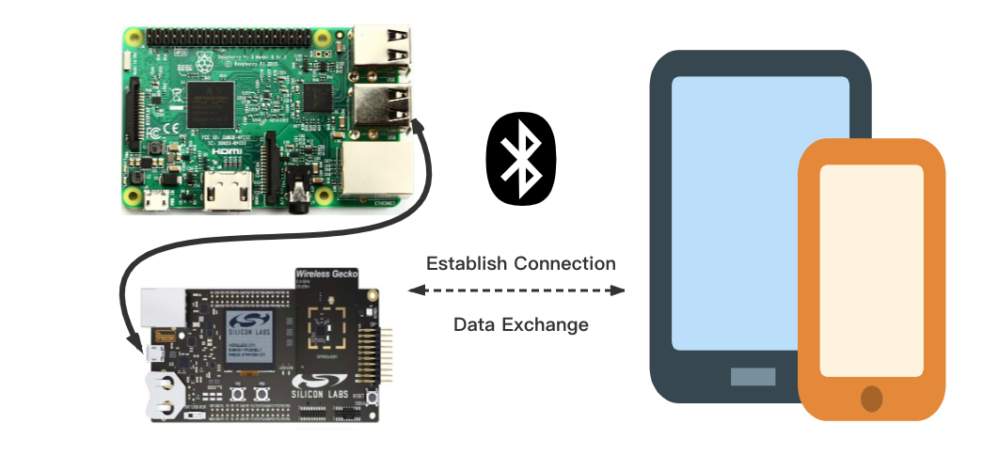
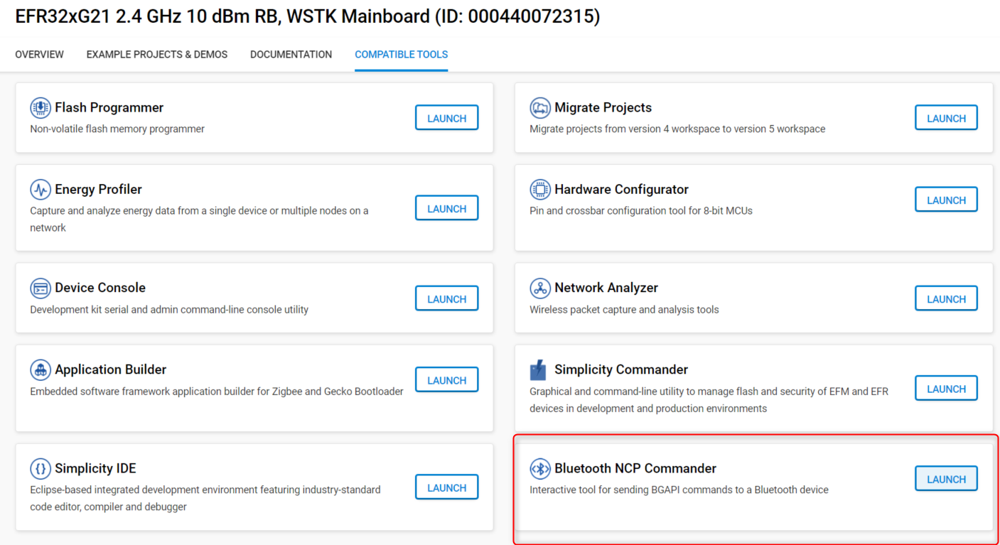
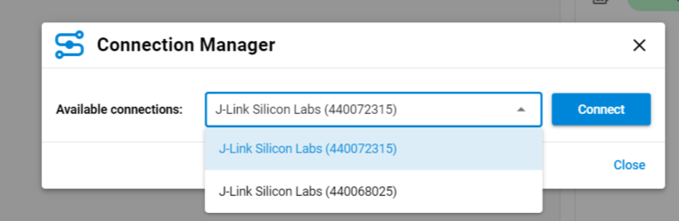
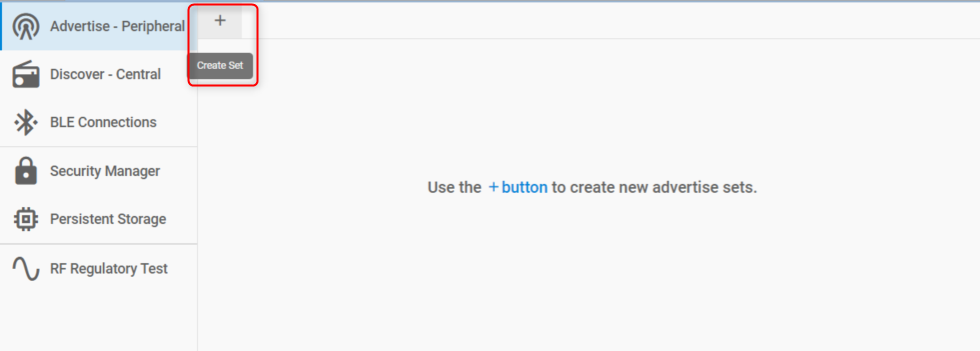
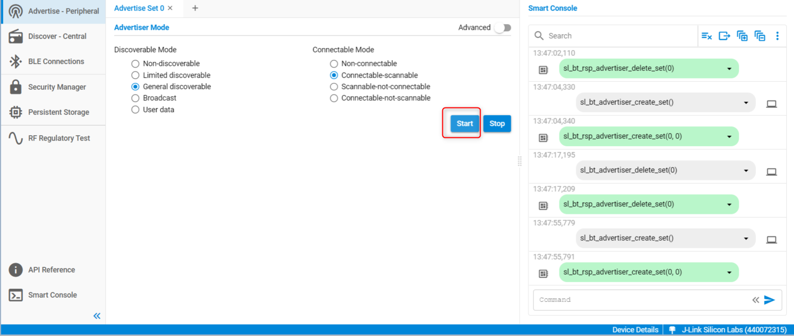

# NCP

This is a Network  Co-Processor (NCP) target application. It runs the Bluetooth stack and provides access to it by exposing the Bluetooth API (BGAPI) via UART  connection. NCP mode makes it possible to run your application on a host  controller or PC.

This example does not have a GATT database, but makes it  possible to build one from the application using Dynamic GATT API. Use this example together with NCP host example applications.

> Note: This example does not include Device Firmware Update (DFU) functionality by default. For details see the [Device Firmware Update](#device-firmware-update) section.

## Getting Started

To get started with Silicon Labs Bluetooth software and Simplicity Studio, see [QSG169: Bluetooth SDK v3.x Quick Start Guide](https://www.silabs.com/documents/public/quick-start-guides/qsg169-bluetooth-sdk-v3x-quick-start-guide.pdf).

In the NCP context, the application runs on a host MCU or PC, which is called the NCP Host, while the Bluetooth stack runs on an EFR32, which is called the NCP Target.

The NCP Host and Target communicate via a serial interface (UART), which can be tunneled either via USB or via Ethernet if you use a development kit. The communication between the NCP Host and Target is defined in the Silicon Labs proprietary protocol called BGAPI. BGLib is the C reference implementation of the BGAPI protocol, which is to be used on the NCP Host side.

[AN1259: Using the v3.x Silicon Labs Bluetooth Stack in Network Co-Processor Mode](https://www.silabs.com/documents/public/application-notes/an1259-bt-ncp-mode-sdk-v3x.pdf) provides a detailed description how NCP works and how to configure it for your custom hardware.

The following figures show the system view of NCP mode.

## Evaluating with Bluetooth NCP Commander

NCP Commander can be used to control the target and test NCP firmware without developing your own host application. In Simplicity Studio, browse to the Launcher -> Compatible Tools tab and open NCP Commander. A shortcut to the Compatible Tools can also be found on the top toolbar. Follow these steps to make the NCP target advertise. See [AN1259: Using the Silicon Labs v3.x Bluetooth Stack in Network Co-Processor Mode](https://www.silabs.com/documents/public/application-notes/an1259-bt-ncp-mode-sdk-v3x.pdf) for additional details. 

1. Connect the board to a PC via USB and start NCP Commander from Simplicity Studio.

2. Choose the board from the list and click **Connect**.

3. The NCP host will try to get the Bluetooth address from the NCP target. If it succeeds, the connection is established.

4. Click **Create Set** and then **Start** under "Advertise Set (0)" table to start advertising. See the "Smart Console" for details.
    
    

5. Open the Simplicity Connect or any Bluetooth browser application to see your device advertising (without any name). You may also connect to the device, although it does not have a GATT database to be discovered by default.

## Extending the GATT database

This example project does not have a GATT database. It only contains the Generic Attributer Service. The GATT database can be built with the APIs provided by the Dynamic GATT Configurator component. See the Bluetooth API reference manual section "GATT Database" for more details.

## Device Firmware Update

This example project does not include Device Firmware Update (DFU) functionality by default.
To add DFU to an existing project:
- Add the `Bootloader Interface` component to your project using Simplicity Studio’s Software Component browser.
- Add a post-build step to generate the GBL (Gecko Bootloader) file using Simplicity Studio’s Post Build Editor.
- Rebuild the project.
- Flash the `Bootloader - NCP BGAPI UART DFU` bootloader to the device.

See the `Bluetooth - NCP DFU` example solution for reference.

For more information on bootloaders, see [UG103.6: Bootloader Fundamentals](https://www.silabs.com/documents/public/user-guides/ug103-06-fundamentals-bootloading.pdf) and [UG489: Silicon Labs Gecko Bootloader User's Guide for GSDK 4.0 and Higher](https://www.silabs.com/documents/public/user-guides/ug489-gecko-bootloader-user-guide-gsdk-4.pdf).

## Troubleshooting

### Programming the Radio Board

Before programming the radio board mounted on the mainboard, make sure the power supply switch is in the AEM position (right side) as shown below.

## Resources

[Bluetooth Documentation](https://docs.silabs.com/bluetooth/latest/)

[UG103.14: Bluetooth LE Fundamentals](https://www.silabs.com/documents/public/user-guides/ug103-14-fundamentals-ble.pdf)

[QSG169: Bluetooth SDK v3.x Quick-Start Guide](https://www.silabs.com/documents/public/quick-start-guides/qsg169-bluetooth-sdk-v3x-quick-start-guide.pdf)

[AN1259: Using the v3.x Silicon Labs Bluetooth Stack in Network Co-Processor Mode](https://www.silabs.com/documents/public/application-notes/an1259-bt-ncp-mode-sdk-v3x.pdf)

[Bluetooth Training](https://www.silabs.com/support/training/bluetooth)

## Report Bugs & Get Support

You are always encouraged and welcome to report any issues you found to us via [Silicon Labs Community](https://www.silabs.com/community).